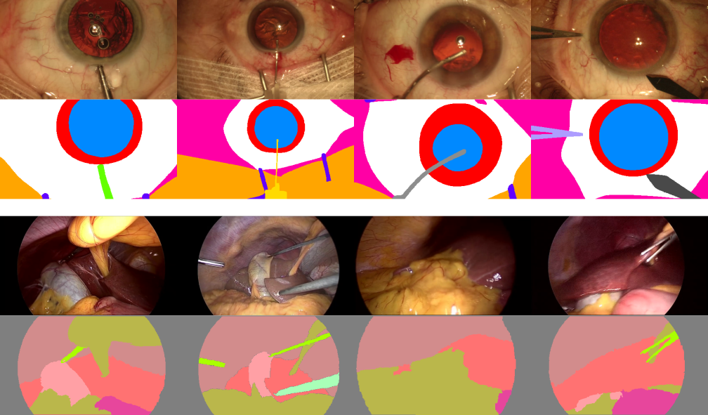

# Surgical Data Science Playground
A repository for unified dataset classes for various Surgical Data Science datasets.



## Usage
1. Clone this repository.
2. ```cd``` into your local clone of this repository.
3. Create and activate a virtual environment of your choice.
4. Install the package via ```pip install -e .```
5. Have fun with surgical data!

## Currently implemented datasets:
* [CATARACTS](sds_playground/datasets/cataracts/README.md)
* [CaDISv2](sds_playground/datasets/cadisv2/README.md)
* [CholecSeg8k](sds_playground/datasets/cholecseg8k/README.md)
* [M2CAI Seg](sds_playground/datasets/m2caiseg/README.md)
* [Cataract-1k](sds_playground/datasets/cataract1k/README.md)

## Open ToDo's
* [ ] Add Cataract-1k Phase Prediction and Irregularity Detection tasks
* [ ] Add Cholec80 (video data!)
* [ ] Add Cataract101 (video data!)
* [ ] Add SG support for segmentation datasets
* [ ] Fill README.md for every dataset
* [ ] Sample weight / unique class computation for M2CAI Seg
* [ ] M2Cai Seg to nnUNet conversion
* [ ] Cataract-1k to nnUNet conversion

## Requested Datasets and Features
If you have any missing dataset or any improvements in mind, then feel free to contribute or create a feature request!